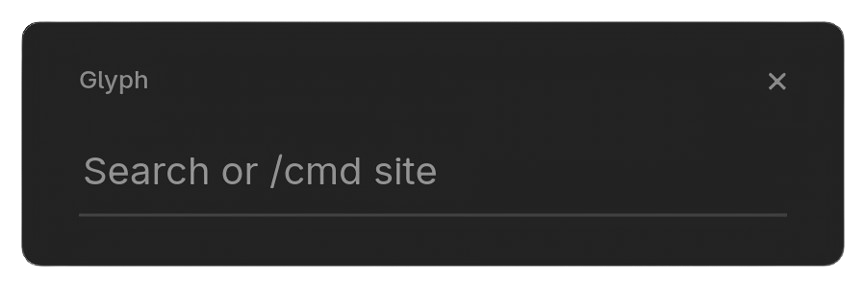
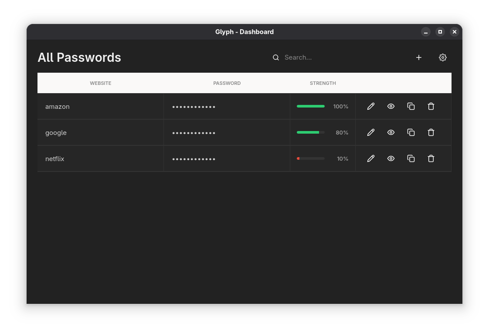
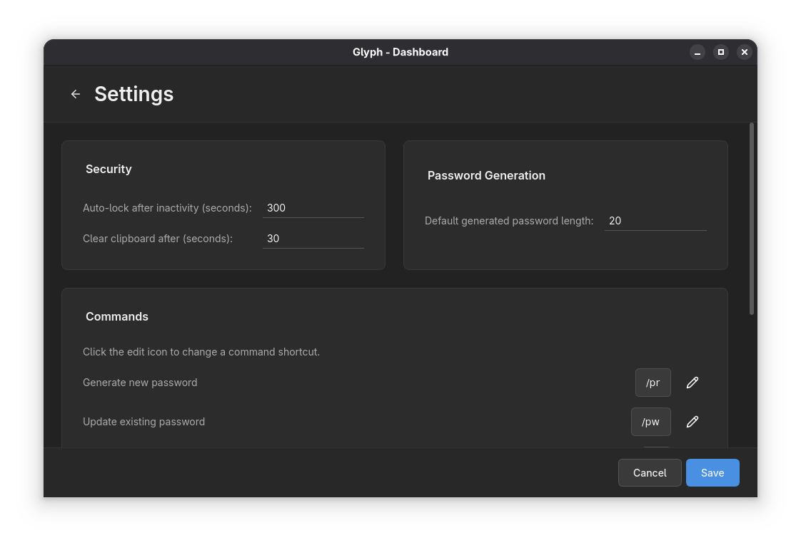

# Glyph Password Manager

<p align="center">
  
</p>

<p align="center">
  <strong>A minimal, secure, and offline-first password manager for the desktop.</strong>
  <br />
  <br />
  <a href="https://github.com/your-username/glyph/releases/latest">
    
  </a>
  <a href="https://github.com/your-username/glyph/blob/main/LICENSE">
    
  </a>
</p>

---

<p align="center">
  
</p>

<p align="center">
  
</p>

<p align="center">
  
</p>

---

Glyph is designed for users who want complete control over their sensitive data without relying on third-party servers or subscriptions. It combines a fast, command-driven interface with a powerful graphical dashboard, all built on a foundation of transparent, modern cryptography.

Your encrypted vault never leaves your computer.

## Features

*   🔒 **Ultra-Secure Encryption:** Your vault is protected with the industry-leading **Argon2id** key derivation function and **AES-256-GCM** authenticated encryption.
*   💻 **Offline First:** Your data is stored locally and only locally. There are no cloud servers, no tracking, and no subscriptions.
*   🛡️ **Per-Password Security:** Every password in your vault is individually encrypted with its own unique key, which is then encrypted by your master key for layered security.
*   🔍 **Tamper-Proof Vault:** The entire encrypted vault is cryptographically signed with **HMAC-SHA256** to detect any corruption or malicious modification before decryption is ever attempted.
*   ✨ **Modern Interface:** A clean, fast, and intuitive user interface built with Python and Qt 6, featuring both a quick-access command bar and a full dashboard.
*   🌐 **Cross-Platform:** A single codebase provides a native experience on **Windows**, **macOS**, and **Linux**.
*   📖 **Open Source:** Glyph is free and open-source software. You can inspect the code to verify its security and functionality.

## Installation

1.  Go to the [**Latest Release** page](https://github.com/uthvah/glyph/releases/latest).
2.  Download the appropriate installer for your operating system:
    *   **Windows:** `Glyph-Windows.exe`
    *   **macOS:** `Glyph-macOS.app` (You may need to right-click -> Open the first time)
    *   **Linux:** `Glyph-Linux-x86_64` (Make it executable with `chmod +x` and run)
3.  On first launch, you will be prompted to create a strong master password. **This password is the only key to your vault and cannot be recovered if lost.**

## How to Use Glyph

Glyph has two main interfaces: the **Command Bar** for quick actions and the **Dashboard** for a full overview.

### The Command Bar

This is the main window that appears when you launch Glyph. You can either search for an existing entry or use a command.

#### Searching and Copying
Simply type the name of the website or service you want (e.g., `GitHub`). If an entry is found, Glyph will automatically copy the password to your clipboard and clear it after 30 seconds.

#### Adding a New Password
If you type the name of an entry that doesn't exist (e.g., `New Awesome Service`), Glyph will prompt you to enter a password for this new site.

### Commands

All commands are prefixed with a forward slash (`/`) and are followed by the name of the site.

| Command | Alias | Action | Example |
| :--- | :--- | :--- | :--- |
| **Generate Password** | `/pr` | Creates a new entry with a strong, randomly generated password and copies it to the clipboard. | `/pr GitHub` |
| **Update Password** | `/pw` | Prompts you to enter a new password for an existing entry. | `/pw GitHub` |
| **Rename Entry** | `/n` | Prompts you for a new name for an existing entry. | `/n GitHub` |
| **Remove Entry** | `/r` | Permanently removes an entry from your vault. | `/r GitHub` |
| **Open Dashboard** | `/dash` | Opens the graphical dashboard for a full view of all your passwords. | `/dash` |
| **Open Settings** | `/settings` | Opens the settings view directly. | `/settings` |
| **Exit Glyph** | `/exit` | Closes the application. | `/exit` |

*Note: The command aliases (`/pr`, `/pw`, etc.) can be customized in the settings menu.*

### The Dashboard

The dashboard provides a graphical way to view, add, edit, and delete all of your entries.

*   **Search:** Use the search bar to filter your passwords in real-time.
*   **Add New:** Click the **plus** icon to add a new entry.
*   **Edit:** Click the **pencil** icon on any row to edit the site name and password inline.
*   **Show/Hide Password:** Click the **eye** icon to toggle password visibility.
*   **Copy:** Click the **clipboard** icon to copy the password.
*   **Delete:** Click the **trash** icon to initiate an inline confirmation to delete the entry.
*   **Settings:** Click the **gear** icon to access the application settings.

## Security Design

Transparency is key to trust. Here is how Glyph protects your data:

1.  **Master Password:** Your master password is the only input. It is never stored.
2.  **Salt:** A unique, cryptographically secure 16-byte salt is generated and saved locally (`master.bin`). This salt is used to protect against rainbow table attacks.
3.  **Key Derivation (Argon2id):** Your master password and the salt are fed into the Argon2id algorithm. Argon2id is a modern, memory-hard function that is highly resistant to both GPU and custom hardware (ASIC) cracking attempts. It produces a 64-byte derived key.
4.  **Key Splitting:** The 64-byte derived key is split into two independent 32-byte keys: an **Encryption Key** and an **HMAC Key**.
5.  **Vault Encryption (AES-256-GCM):** The entire vault of passwords is encrypted using AES-256 in GCM mode with the Encryption Key. AES-GCM provides both confidentiality and authenticity.
6.  **Vault Integrity (Encrypt-then-MAC):** After encryption, the *entire* resulting ciphertext is signed using HMAC-SHA256 with the HMAC Key. This signature is stored separately (`vault.hmac`).
7.  **Decryption Process:** When you unlock your vault, the process is reversed:
    *   The HMAC key is derived and used to verify the signature on the vault file. If the verification fails, the process stops immediately. **No decryption is attempted on a tampered file.**
    *   Only if the integrity check passes is the Encryption Key used to decrypt the vault.

## Building from Source

If you prefer to build Glyph yourself, you'll need Python 3.9+ and pip.

1.  **Clone the repository:**
    ```bash
    git clone https://github.com/uthvah/glyph.git
    cd glyph
    ```

2.  **Create a virtual environment (recommended):**
    ```bash
    python -m venv venv
    source venv/bin/activate  # On Windows, use `venv\Scripts\activate`
    ```

3.  **Install dependencies:**
    ```bash
    pip install -r requirements.txt 
    ```

4.  **Compile Qt Resources:**
    The icons and stylesheet are bundled into a Python file. Run this command:
    ```bash
    pyside6-rcc resources.qrc -o resources_rc.py
    ```

5.  **Run the application:**
    ```bash
    python glyph.py
    ```

## License

This project is licensed under the MIT License. See the [LICENSE](LICENSE) file for details.
