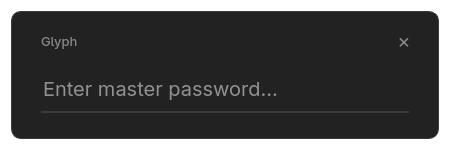

# Glyph Password Manager

<p align="center">
  
</p>

<p align="center">
  <strong>A minimal, secure, and offline-first password manager for the desktop.</strong>
  <br />
  <br />
  <a href="https://github.com/your-username/glyph/releases/latest">
    
  </a>
  <a href="https://github.com/your-username/glyph/blob/main/LICENSE">
    
  </a>
</p>

---

<p align="center">
  
</p>

<p align="center">
  
</p>

<p align="center">
  
</p>

---

Glyph is a password manager built on a simple principle: **your data is yours**. It combines state-of-the-art, transparent cryptography with a clean, modern user interface. Your encrypted vault is stored locally and only locally. There are no cloud servers, no subscriptions, and no tracking.

## ✨ Why Choose Glyph?

*   🔐 **State-of-the-Art Encryption:** Your vault is protected with the current industry-best **Argon2id** key derivation function and **AES-256-GCM** authenticated encryption.
*   💻 **100% Offline & Local:** Your vault file never leaves your computer. You have complete, sovereign control over your most sensitive data.
*   🛡️ **Envelope Encryption:** Every password in your vault is individually encrypted with its own unique key, which is then encrypted by your master key. This layered security model ensures a breach of one entry's key cannot affect any other.
*   🔍 **Tamper-Proof by Design:** The entire vault is cryptographically signed with **HMAC-SHA256**. Glyph verifies this signature before attempting decryption, immediately detecting any corruption or malicious modification.
*   🚀 **Dual Interface:** Use the lightning-fast **Command Bar** for quick actions or open the full-featured **Dashboard** for a complete graphical overview.
*   📈 **Forward-Thinking Security:** Glyph detects when your vault's encryption parameters can be improved and provides a simple, secure path to upgrade, keeping you safe from future threats.
*   📖 **Free & Open Source:** Glyph is FOSS. Inspect the code, verify the security, and contribute to its development. You never have to trust—you can verify.

## 🚀 Getting Started

Go to the [**Latest Releases Page**](https://github.com/your_username/glyph/releases/latest) and download the appropriate package for your operating system.
(Installers coming soon! Ignore the table for now.)

| Operating System | Download File | Instructions |
| :--- | :--- | :--- |
| **Windows** | `Glyph-vX.Y.Z-Setup.exe` | Run the installer and follow the on-screen instructions. |
| **macOS** | `Glyph-vX.Y.Z.dmg` | Open the DMG, then drag the **Glyph** icon into your **Applications** folder. |
| **Linux** | `Glyph-vX.Y.Z.AppImage` | 1. Make the file executable: `chmod a+x Glyph-vX.Y.Z.AppImage`<br/>2. Run it: `./Glyph-vX.Y.Z.AppImage` |

On first launch, you will be guided by a setup wizard to create your master password. **This password is the only key to your vault and cannot be recovered if lost.**

## 💡 How to Use

#### The Command Bar

The command bar is designed for speed. Type the name of a site to instantly copy its password, or use a command for more advanced actions.

| Action | Command | Example |
| :--- | :--- | :--- |
| **Search & Copy** | (Just type the name) | `GitHub` |
| **Add New Entry** | (Type a new name) | `New Awesome Service` |
| **Generate Password** | `/pr <site>` | `/pr reddit.com` |
| **Update Password** | `/pw <site>` | `/pw reddit.com` |
| **Rename Entry** | `/n <site>` | `/n reddit.com` |
| **Remove Entry** | `/r <site>` | `/r reddit.com` |
| **Open Dashboard** | `/dash` | `/dash` |

*Note: Command aliases (`/pr`, `/pw`, etc.) can be customized in Settings.*

---

## 🛡️ The Glyph Security Model

Transparency is the foundation of trust. Here is a step-by-step breakdown of how Glyph protects your data:

1.  **Master Password:** Your master password is used as input only. It is **never** stored on disk.
2.  **Salt:** A unique, 16-byte cryptographically secure salt is generated during setup and saved locally. This salt ensures that two identical master passwords produce completely different encryption keys and protects against pre-computed (rainbow table) attacks.
3.  **Key Derivation (Argon2id):** Your master password and salt are processed by **Argon2id**, a modern, memory-hard function that is highly resistant to both GPU and custom hardware (ASIC) cracking attempts. This derives a single 64-byte master key.
4.  **Key Splitting:** The 64-byte master key is securely split into two independent 32-byte keys:
    *   An **Encryption Key** (for confidentiality)
    *   An **HMAC Key** (for integrity and authenticity)
5.  **Envelope Encryption:** For each password you save, Glyph generates a new, unique **Entry Key**. Your password is encrypted with this Entry Key using **AES-256-GCM**. This Entry Key is then itself encrypted ("wrapped") by your master Encryption Key. This robust model ensures that the compromise of a single entry does not affect the security of the rest of your vault.
6.  **Vault Integrity (Encrypt-then-MAC):** After all data is encrypted, the entire resulting ciphertext of the vault is signed using **HMAC-SHA256** with the master HMAC Key. This signature proves that the vault has not been altered or corrupted since it was last saved.
7.  **Decryption Process:** When you unlock your vault, the process is safely reversed:
    *   The integrity of the vault file is checked *first*. If the HMAC signature is invalid, the process stops immediately. No decryption is ever attempted on a tampered file.
    *   Only if the integrity check passes is your master Encryption Key used to decrypt the vault data.

## 🛠️ Building from Source

If you prefer to build Glyph yourself, you will need Python 3.9+.

```bash
# 1. Clone the repository
git clone https://github.com/your_username/glyph.git
cd glyph

# 2. Create and activate a virtual environment (recommended)
python3 -m venv venv
source venv/bin/activate  # On Windows: venv\Scripts\activate

# 3. Install dependencies from the requirements file
pip install -r requirements.txt

# 4. Compile Qt Resources (icons, stylesheet)
pyside6-rcc resources.qrc -o resources_rc.py

# 5. Run the application
python3 your_main_script.py
```

## 🗺️ Contributing & Roadmap

Glyph is an active project with the goal of becoming a premier, modern alternative to established password managers. Contributions are welcome! Feel free to open an issue to report bugs, suggest features, or submit a pull request.

Key areas for future development:
- Browser Extension Integration
- TOTP (One-Time Password) Support
- Additional Secure Fields (username, URL etc) and Notes
- Advanced Import/Export (KeePass KDBX, etc.)
- Plugin Architecture for Extensibility

## License

This project is licensed under the GNU GPLv3 License. See the LICENSE file for details.
